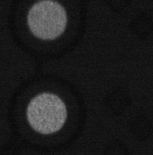
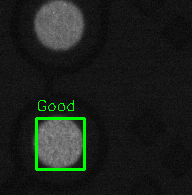
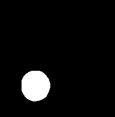
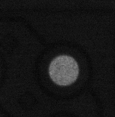
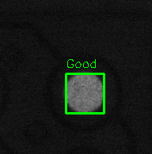
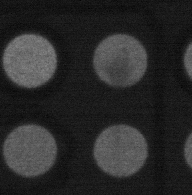
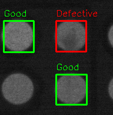
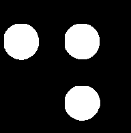

# Defect Detection using Traditional Computer Vision

A lightweight defect detection pipeline built with OpenCV. It analyzes objects in images using pre-generated segmentation masks and classifies each object as **Good** or **Defective** based on dark pixel intensity analysis.

## How It Works

1. **Load** a color image and its corresponding binary segmentation mask.
2. **Binarize** the mask and extract object contours.
3. **Classify** each object by measuring the ratio of dark pixels within its contour region. If the ratio exceeds a configurable threshold, the object is marked as **Defective**; otherwise, it is **Good**.
4. **Annotate** the image with color-coded bounding boxes and labels (green for Good, red for Defective).
5. **Save** the annotated result.

## Sample Results

| Input Image | Predicted Output | Segmentation Mask |
|:-----------:|:----------------:|:-----------------:|
|  |  |  |
|  |  |  |
|  |  |  |

## Project Structure

```
Traditional_CV/
├── main.py                  # Entry point — orchestrates the pipeline
├── config.py                # Thresholds and directory paths
├── detector/
│   ├── preprocessing.py     # Mask binarization & contour extraction
│   ├── classifier.py        # Dark-pixel defect classification
│   └── visualizer.py        # Bounding box & label drawing
└── utils/
    └── io.py                # Image/mask loading & result saving
```

## Requirements

- Python 3.7+
- OpenCV (`cv2`)
- NumPy

Install dependencies:

```bash
pip install opencv-python numpy
```

## Usage

1. Place your input images in the `samples/images/` directory.
2. Place the corresponding segmentation masks (same filenames) in the `samples/masks/` directory.
3. Run the pipeline:

```bash
python main.py
```

4. Annotated results will be saved to the `samples/outputs/` directory.

## Configuration

All parameters are defined in `config.py`:

| Parameter | Default | Description |
|---|---|---|
| `IMAGE_DIR` | `image` | Directory containing input images |
| `MASK_DIR` | `mask` | Directory containing segmentation masks |
| `OUTPUT_DIR` | `results` | Directory for saving annotated results |
| `DARK_PIXEL_THRESHOLD` | `60` | Pixel intensity below which a pixel is considered dark |
| `DARK_PIXEL_RATIO_THRESHOLD` | `0.03` | Minimum dark pixel ratio to classify an object as defective |
